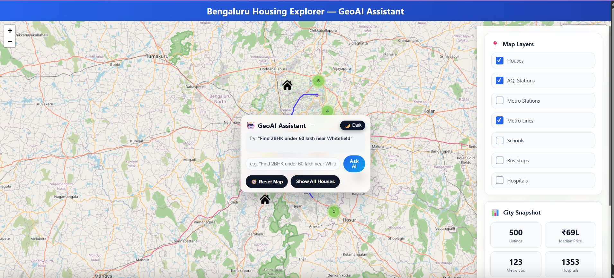
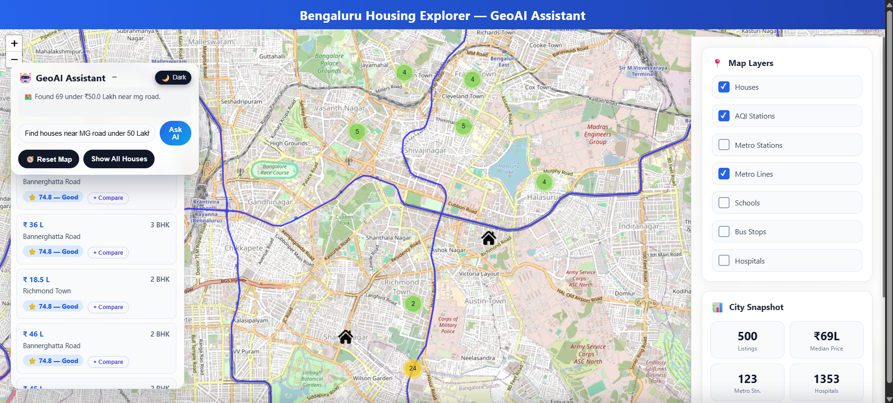
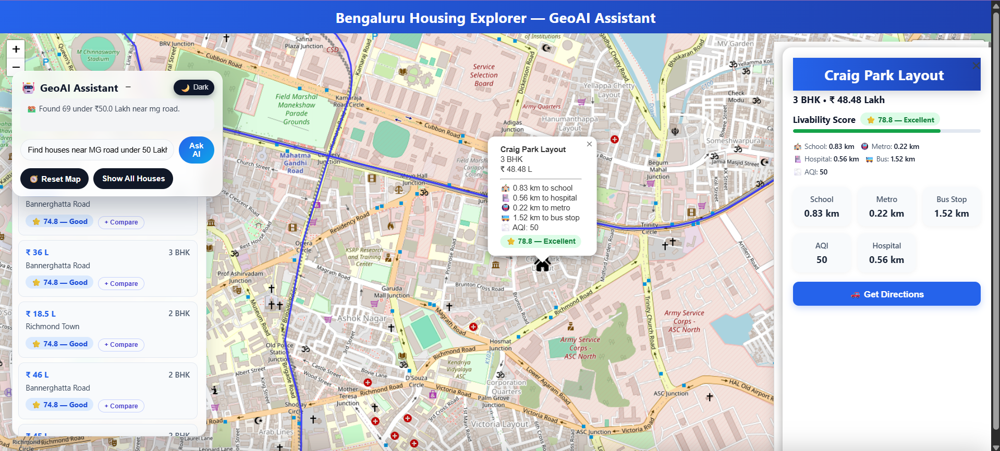
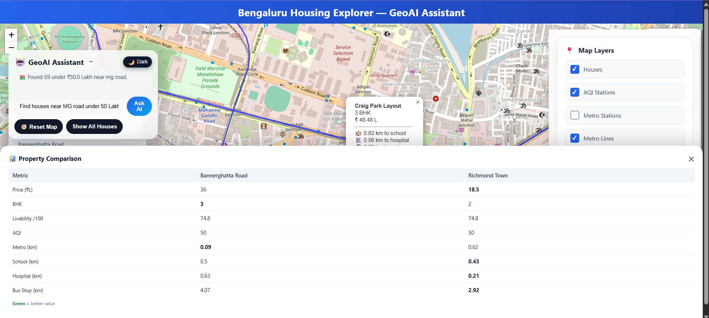

# GeoGenRent – GeoAI-Based Intelligent Housing Explorer

GeoGenRent is a GeoAI-inspired housing exploration platform for Bengaluru that combines geospatial analytics, interactive mapping, and intelligent recommendation techniques to help users discover suitable properties based on location, price, amenities, and environmental factors.

The application integrates housing listings with spatial datasets such as metro stations, schools, hospitals, bus stops, and Air Quality Index (AQI) to provide a more informed property selection experience.

---

## Live Demo

🌐 https://geogenrent.onrender.com

---

## Features

- Interactive Leaflet map
- Property search by:
  - Budget
  - BHK
  - Location
  - Nearby metro stations
  - Schools
  - Hospitals
  - Bus stops
- Livability Score for each property
- City Snapshot dashboard with real statistics
- Nearby amenity analysis
- Metro line and station visualization
- AQI visualization
- Property comparison tool
- Dark / Light mode
- Rule-based intelligent property recommendations

---

## Technology Stack

### Backend
- Python
- Flask
- Pandas
- NumPy
- Shapely
- Geopy

### Frontend
- HTML5
- CSS3
- JavaScript
- Leaflet.js
- Chart.js

### Spatial Data
- GeoJSON
- CSV datasets
- OpenStreetMap
- Nominatim Geocoder

---

## Project Workflow

User Preferences
(Budget, BHK, Location)
↓
Dataset Filtering
↓
Geospatial Analysis
↓
Distance Calculations
(Metro, Schools, Hospitals, Bus Stops, AQI)
↓
Scoring & Ranking
↓
Interactive Map Recommendations

---

## Project Structure

```text
GeoGenRent/
│
├── app.py
├── requirements.txt
├── templates/
│   └── index.html
├── static/
│   ├── app.js
│   ├── style.css
│   ├── metro-lines-stations.geojson
│   ├── cleaned_with_coordinates.csv
│   ├── cleaned_hospitals.csv
│   ├── cleaned_1000_schools.geojson
│   ├── bengaluru_aqi.csv
│   └── bus_stop_cleaned.csv
└── scripts/
    └── convert.py
```

---

## Installation

Clone the repository

```bash
git clone https://github.com/YOUR_USERNAME/GeoGenRent.git
cd GeoGenRent
```

Create a virtual environment

```bash
python -m venv .venv
```

Activate it (Windows)

```bash
.venv\Scripts\activate
```

Install dependencies

```bash
pip install -r requirements.txt
```

Run the application

```bash
python app.py
```

Open:

https://geogenrent.onrender.com

---

## Screenshots

<table>
<tr>
<td align="center">
<br>
<b>Home Dashboard</b>
</td>

<td align="center">
<br>
<b>Property Search Results</b>
</td>
</tr>

<tr>
<td align="center">
<br>
<b>Property Details</b>
</td>

<td align="center">
<br>
<b>Property Comparison</b>
</td>
</tr>
</table>

---

## Future Improvements

- Machine learning-based house price prediction
- Personalized recommendation engine
- Semantic natural language search
- Route planning
- Real-time traffic integration
- Mobile-responsive layout improvements

---

## Team

This project was developed as a group academic project by:

- Hrudya Sudhees
- Ribu P B

---

## Contributions

### Hrudya Sudhees
- Frontend development using HTML, CSS, JavaScript, and Leaflet.js
- Interactive map design and UI implementation
- Property visualization and comparison interfaces
- Dashboard creation and user experience enhancements
- Integration of map layers and frontend components

### Ribu P B
- Backend development using Python and Flask
- Geospatial data processing and dataset integration
- Implementation of filtering, distance calculations, and recommendation workflow
- Integration of spatial datasets (metro, schools, hospitals, bus stops, AQI)
- Development of scoring logic and analytics functionalities
